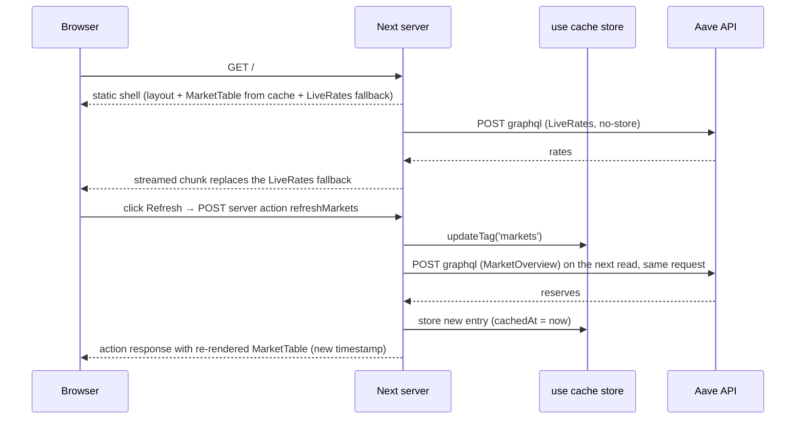

# Lend Lens — a Next.js 16 playground on live DeFi lending data

## Problem Statement

I know React and Vite SPAs well; I do not have a working mental model of Next.js App Router
(server vs client components, what is prerendered, cached or streamed, and why). Reading docs
does not stick. I need a small app I built myself, running live, where every screen block shows
which rendering mode produced it, so the model is in my hands and I can explain it to others.

**Evidence:** intuition plus a concrete gap: Next.js has been on my "do not claim" list for years.
The caching model changed three times (13.4 → 15 → 16) and I cannot narrate the change without notes.

## Goal

A deployed, public Next.js 16 app on live Aave V3 lending data (public API, no keys) that
demonstrates every major App Router concept in one place, one concept per file, with a README that
maps file → concept, and a running log of "how this differs from plain React/JS". Done means: it is
live on a public URL, it runs the same in Docker, and I can walk someone through each concept
with the page open.

## Prior Art

Already built and working locally (uncommitted, in this repo):

- Markets page: cached reserves table next to an uncached, streamed live-rates panel; Refresh button
  that invalidates the cache through a server function.
- Reserve page: three reserves prebuilt, others rendered on first visit and kept; an APY chart that
  receives a promise from the server.
- Wallet page: positions cached per address, health factor computed in tested local code and shown
  next to a live on-chain read; error boundary for bad input.
- JSON endpoint served from cache; webhook-style revalidation endpoint; two proxy redirects.
- Exact decimal maths and health-factor library with unit tests; Dockerfile for standalone output.

Sibling project `lamport-lens` (Solana, Vite) sets the house style: README with a feature table in
build order, each feature answering a question, plus a running notes file of surprises.

## Non-Goals & Tradeoffs

- **No wallet connection, no transactions** — read-only data keeps the app keyless and safe to
  host publicly; the learning target is the framework, not signing flows.
- **No second chain or Aave V4** — one market is enough to exercise every rendering mode; more
  markets add data plumbing, not Next.js knowledge.
- **No design polish / component library** — Tailwind utility classes only; time goes into the
  concepts, and the "static / cached / live" tags are the UI.
- **No custom domain** — a `*.vercel.app` URL is fine for a playground; a domain is money and DNS
  time for zero learning.
- **No Vercel-only features** (Analytics, KV, Cron, Speed Insights) — the point is to show the app
  is not tied to Vercel; Docker is the second deploy target.
- **No analytics or auth** — nothing to protect, nothing to measure.

## Intended Behavior

### Run locally and in production mode `MVP`

`pnpm dev` starts the app; `pnpm build && pnpm start` serves the production build where caching
actually behaves (dev never caches). Unit tests and lint pass.

**Acceptance criteria:**

- [ ] Fresh clone: install, test, lint, typecheck, build all succeed with one command each.
- [ ] Every page carries visible "static / cached / live" tags with the time the block was produced.
- [ ] Fetching the home page shows the shell first and the live panel as a later chunk (verifiable with `curl -N`).

### Deploy to a public URL `MVP`

Push to a public GitHub repo, import into Vercel Hobby, get a live URL with zero config.

**Acceptance criteria:**

- [ ] The live URL serves all three pages and both API routes.
- [ ] The Refresh button changes the cached timestamp on the live site without a redeploy.
- [ ] The revalidate endpoint refuses requests without the secret when a secret is configured.
- [ ] Nothing in the repo or the deployed page identifies why the project exists beyond "learning Next.js".

### Run the same app in Docker `MVP`

Build the image and run it locally; the same pages, streaming and caching behave the same.

**Acceptance criteria:**

- [ ] `docker build` succeeds from a clean checkout; `docker run` serves the home page.
- [ ] README states the one behavioural difference (cache store is per instance, not shared).

### Correct 404 and error behaviour `MVP`

Unknown reserve → a real 404 status, not a 200 with a "not found" body. Bad wallet address → the
error boundary shows a human message in production, not only a digest, and Retry works.

**Acceptance criteria:**

- [ ] `/markets/1/NOPE` returns HTTP 404.
- [ ] `/wallet/notanaddress` renders a message saying it is not an address, in the production build.
- [ ] The Retry button re-runs the request.

### README + notes `MVP`

README in the lamport-lens style: what it is, a table "file → concept it proves → how to see it",
run instructions, deploy instructions (Vercel + Docker), and a 20-second narration of the caching
timeline 13.4 → 15 → 16. A separate notes file logs every "this is different from plain React/JS"
surprise hit while building, with the fix.

**Acceptance criteria:**

- [ ] Every file under `src/app` and `src/lib` appears in the concept table.
- [ ] The notes file has at least one entry per drill below.

### Drill: the server/client boundary `MVP`

A page that deliberately shows what can and cannot cross from a Server Component to a Client
Component (a `bigint`, a function, a Date, a class instance, a promise), what happens when a Client
Component imports server-only code, and the correct pattern for each.

**Acceptance criteria:**

- [ ] The page lists each case with: what was tried, what the framework said, the working pattern.
- [ ] Attempting the wrong import is documented as a build error (recorded, not left in the build).

### Drill: what makes a cache key `MVP`

Show that arguments and closed-over variables of a cached function are part of its key; show a
private (per-request) cache that may read cookies; show tag versus time expiry side by side.

**Acceptance criteria:**

- [ ] Two calls with different arguments produce two entries with different timestamps.
- [ ] A cookie-dependent value renders per request without breaking the static shell.
- [ ] Tag invalidation and time expiry are both observable on one page.

### Drill: forms and server functions `Stretch`

The wallet lookup form works with JavaScript disabled, shows validation errors returned from the
server function, a pending state, and redirects on success.

**Acceptance criteria:**

- [ ] With JS disabled, submitting a bad address shows an error; a good one navigates.
- [ ] With JS enabled, the button shows a pending state and no full-page reload happens.

### Drill: route handlers, static vs dynamic `Stretch`

Two JSON endpoints side by side: one prerendered/cached, one always dynamic (reads request headers),
with response headers that make the difference visible.

**Acceptance criteria:**

- [ ] Repeated requests to the cached endpoint return the same timestamp until invalidated.
- [ ] The dynamic endpoint returns a new timestamp and echoes a request header on each call.

### Drill: smoke test script `Stretch`

One script that hits every route on a running server and checks status codes, chunked streaming,
redirects and the JSON shape, usable locally, in Docker and against the live URL.

**Acceptance criteria:**

- [ ] `pnpm smoke <base-url>` exits non-zero on any failed check.

## Key Screens & Interactions

- **Markets (`/`)**: live-rates panel (streams in), reserves table (cached, Refresh button), links to reserves.
- **Reserve (`/markets/1/<SYMBOL>`)**: parameters (cached) and a 7-day APY chart (live, streamed).
- **Wallet (`/wallet`, `/wallet/<address>`)**: address form; health factor computed locally vs API vs on-chain; supplied and borrowed tables; Refresh.
- **Boundary drill (`/lab/boundary`)** and **Cache-key drill (`/lab/cache`)**: teaching pages, each case a card with "tried / framework said / fix".
- **API**: `/api/reserves/1` (cached JSON), `POST /api/revalidate` (webhook invalidation).

## Edge Cases & Open Questions

| Scenario | Expected Behavior |
| --- | --- |
| Aave API is down or slow | Cached blocks keep serving the last entry; live blocks show an inline error in their own boundary, the rest of the page still renders. |
| Public RPC rate-limits the on-chain read | Only the on-chain line fails, with a retry; the page and API-based health factor still show. |
| Wallet with no positions | Health factor shows "∞", tables say "Nothing here", no error. |
| Wallet in E-Mode | Local health factor may differ from the API; the page says why (category threshold) instead of hiding it. |
| Reserve symbol in wrong case (`weth`) | Resolves to the same reserve as `WETH`. |
| Vercel Hobby usage cap hit | Project pauses for the cycle; acceptable, documented in README. |
| Cache entries after a new deploy | All entries reset (key includes build id); documented, not worked around. |
| Revalidate endpoint called without secret in production | 401 if a secret is set; open if none is set (playground default). |

## Assumptions

Confirmed by the user on 2026-09-23:

- [x] Scope for this round: base app, 404/error fixes, README + NOTES, deploy (Vercel + Docker), boundary drill, cache-key drill. Forms, static-vs-dynamic API and the smoke script stay Stretch.
- [x] Repo `lend-lens`, public, under the user's GitHub account, `main` only, no PR flow. Vercel Hobby via GitHub import, default `*.vercel.app` URL; the user clicks Import once.
- [x] `.ai/` is committed. It reads as a learning-project plan, nothing else.
- [x] `NOTES.md` in the repo: one entry per "different from plain React/JS" surprise, with the fix (same pattern as lamport-lens `DX-NOTES.md`).
- [x] Data stays Ethereum core market only; Aave is named as the data source in README and footer, nothing more.
- [x] Drills live under `/lab/*`, linked from the nav; teaching pages, not product pages.

## Success Criteria

- [ ] Live public URL serving all pages; Docker image serving the same.
- [ ] All MVP acceptance criteria above checked.
- [ ] Tests, lint, typecheck, build green on `main`.
- [ ] I can narrate the caching timeline and point at the file that proves each concept, without notes.

## System Design

### Approach

Keep the app that exists and add to it; nothing is rewritten. The data layer (`src/lib/aave/data.ts`)
stays the single place where caching decisions are made, and every new page follows the same rule:
a Server Component owns the data, a Client Component appears only where state or events are needed,
and every rendered block carries a `<Mode/>` tag. The two lab pages are ordinary routes under
`src/app/lab/` that use the same data layer and UI primitives. The 404 and error work changes how
failures are *classified* (expected → rendered state, unexpected → boundary) rather than adding
machinery. Deploy is zero-config: Vercel builds from the GitHub repo; Docker uses the existing
standalone output.

### Architecture

**Routes (all in `src/app`)**

- `/` markets, `/markets/[chainId]/[reserve]`, `/wallet`, `/wallet/[address]` — exist; touched only
  for the 404/error changes below.
- `/lab` — index card list linking to the drills; static.
- `/lab/boundary` — one Server Component page rendering a list of "cases". Each case is a card with
  three parts: what was tried, what the framework says, the working pattern, and where it applies
  the working pattern live (bigint → string, function → Server Function, Date/Map/Set pass through,
  class instance → plain object, promise → `use()`, `children` slot of a server tree inside a
  client wrapper). Cases whose failure is a *build* error (a Client Component importing a
  `server-only` module) are described in text and reproduced in `NOTES.md`, not shipped.
  Cases whose failure is a *render* error (passing a `bigint` prop) get a sub-route
  `/lab/boundary/<case>` with its own `error.tsx`, so the real message is visible in `pnpm dev`
  and the boundary is visible in production.
- `/lab/cache` — one page, several cards, each backed by a small cached function in
  `src/lib/lab/cache.ts`:
  - `stamp(label)`: `'use cache'` + `cacheLife('minutes')` + `cacheTag('lab')`; rendered twice with
    different labels to show two entries, and twice with the same label to show one.
  - `stampClosure()`: a `'use cache'` function that closes over a value from its caller, to show the
    captured variable is part of the key.
  - `stampPrivate()`: `'use cache: private'` reading a cookie set by a Server Function; rendered
    inside Suspense so the shell stays static.
  - `stampShort()`: `cacheLife('seconds')`, which the docs exclude from the prerender; shown as a
    streamed hole next to the tagged card so time expiry and tag invalidation sit side by side.
  - Two buttons (Client Components) call Server Functions: `updateTag('lab')` and a cookie toggle.
- Nav gets a "Lab" link.

**Failure classification (404 / errors)**

- Unknown reserve → HTTP 404. Under Cache Components the reserve symbol is runtime data awaited
  inside Suspense, so `notFound()` from the page fires after the shell streamed (status already 200).
  The docs' answer is "decide before streaming, in the proxy". `src/proxy.ts` gains a matcher for
  `/markets/:chainId/:reserve`, fetches the app's own cached JSON (`/api/reserves/1` on
  `request.nextUrl.origin`), and if the symbol is not in the list responds with the 404 page via
  `NextResponse.rewrite` to a route that does not exist (status 404). The same lookup canonicalises
  case (`/markets/1/weth` → 308 → `/markets/1/WETH`) so cache keys and static params never fork on
  case. `notFound()` stays in the page as the second line of defence.
- Bad wallet address → an expected error. The page no longer throws; it renders an
  `<InvalidAddress/>` block (message + link back). `error.tsx` remains for unexpected errors
  (API down, RPC failure) and shows a generic message, the `digest`, and `retry`.
- On-chain line failing (RPC rate-limit) must not take the page down: `OnChain` catches and renders
  an inline "could not read chain, retry" line; retry is the existing Refresh button (the Server
  Function also calls `refresh()` so the uncached read reruns).
- Live-rates and APY chart failures: same pattern, catch inside the streamed component, inline
  message, rest of the page unaffected.

**Docs and scripts**

- `README.md`: what it is, run/test/build, the "file → concept → how to see it" table, deploy
  (Vercel import + Docker), the caching timeline paragraph, Hobby-plan caveats.
- `NOTES.md`: dated entries, each "what I expected / what happened / why / fix", seeded from this
  session's findings (BigInt literals need ES2020 target; route types are generated and go stale;
  ABI export missing from the address book; soft 404 after streaming; production error redaction;
  `notFound()` inside `try/catch`; `seconds` profile excluded from prerender).
- `.env.example` already lists `RPC_URL`; add `REVALIDATE_SECRET`.

### Component layout and data fetching

The whole app, existing pages included, follows one rule set. Read this before touching any page.

**Three layers**

| Layer | Lives in | Runs | Knows about |
| --- | --- | --- | --- |
| Data | `src/lib/aave/*`, `src/lib/viem.ts` (`server-only`) | server only | the Aave GraphQL API, the RPC, caching mode |
| Pure logic | `src/lib/decimal.ts`, `src/lib/health.ts`, `src/lib/format.ts` | anywhere | nothing about Next or the network; unit-tested |
| UI | `src/app/**` (routes), `src/components/*` | server by default, client where marked | props only |

Every route file is a Server Component. A file gets `'use client'` only when it needs state, an
event handler, `use()` on a promise, or a browser API. Today that is exactly three files:
`RefreshButton`, `ApyChart`, and `wallet/[address]/error.tsx`.

**Component tree per route** (S = Server Component, C = Client Component, tags show the rendering mode)

```
RootLayout (S, static)                       nav, footer; no data → part of every shell
│
├─ /  MarketsPage (S)
│    ├─ <Suspense> LiveRates (S, live)        awaits getLiveRates()             → streamed hole
│    │      └─ Stat ×6 (S)
│    └─ <Suspense> MarketTable (S, cached)    awaits getMarketOverview()        → in the shell (use cache)
│           ├─ RefreshButton (C)              prop: refreshMarkets server fn
│           └─ <table> + Link per row
│
├─ /markets/[chainId]/[reserve]  ReservePage (S)
│    └─ <Suspense> Reserve (S)                await params → getReserveBySymbol() (cached)
│           ├─ Stat ×8, addresses
│           └─ <Suspense> ApyChart (C, live)  prop: dataPromise = getApyHistory() (not awaited) → use()
│    loading.tsx                              segment fallback while Reserve resolves
│
├─ /wallet  WalletIndexPage (S, static)       <form action={lookupWallet}> + example links
│
├─ /wallet/[address]  WalletPage (S)
│    └─ <Suspense> Wallet (S)                 await params → isAddress → getUserPositions() (cached per address)
│           ├─ Stat: computeHealthFactor() (pure), API value, collateral, debt
│           ├─ RefreshButton (C)              prop: refreshWallet.bind(address)
│           ├─ <Suspense> OnChain (S, live)   getOnChainAccount() via React.cache, preloaded above
│           └─ PositionTable ×2 (S)
│    error.tsx (C)                            unexpected failures; retry()
│
├─ /lab  (S, static) → /lab/boundary, /lab/cache  (see "Architecture" above)
│
├─ /api/reserves/[chainId]  route.ts          GET → getMarketOverview() → JSON (served from cache)
└─ /api/revalidate          route.ts          POST → revalidateTag('markets','max')
proxy.ts                                      redirects + reserve 404/case (see "Failure classification")
```

**Where fetching happens, and in which mode**

| Function (`src/lib/aave/data.ts`) | Mode | Key | Life | Invalidated by |
| --- | --- | --- | --- | --- |
| `getMarketOverview()` | `'use cache'` | none (one entry) | `minutes` (revalidate 1 m, expire 1 h) | tag `markets`: `updateTag` (button), `revalidateTag(…, 'max')` (webhook) |
| `getReserveBySymbol(symbol)` | `'use cache'` | `symbol` | `minutes` | tags `markets`, `reserve:<symbol>` |
| `getUserPositions(address)` | `'use cache'` | `address` | `minutes` | tag `wallet:<address>` (Refresh on the wallet page) |
| `getLiveRates()` | uncached fetch, `cache: 'no-store'` | – | per request | – (always fresh; must sit under Suspense) |
| `getApyHistory(token, window)` | uncached fetch, returned as a promise | – | per request | – (consumed by `use()` in the client) |
| `getOnChainAccount(address)` | `React.cache` around a viem read | per request | per request | – (dedupe only; `preloadAccount` starts it early) |

Rules that follow from the table:

- A `'use cache'` function may call another `'use cache'` function (`getReserveBySymbol` and
  `getUserPositions` both call `getMarketOverview`); the inner call is a cache hit and the outer
  entry's lifetime is the shorter of the two. Always call `cacheLife` explicitly in each.
- A `'use cache'` function must not read `cookies()`, `headers()` or `searchParams`; the lab's
  `'use cache: private'` is the one exception, by design.
- Anything uncached is awaited only inside a `<Suspense>` boundary, or handed down as a promise. If
  a page awaits uncached data at its top level the build reports a blocking route.
- `params` is a Promise. Pages never await it at the top level; they pass `props.params` to the
  Suspense'd child, so the route keeps a static shell for unknown params.
- `Date.now()` / `new Date()` are allowed inside a cache scope (captured with the entry) and after an
  awaited fetch inside Suspense; nowhere else without `await connection()`.
- Data crosses the server → client boundary as strings and plain objects. Anything `bigint`
  (viem) is formatted or stringified on the server before it reaches a `'use client'` file.
- Server → client wiring is by props only: a Server Function passed as a prop (`action`), a promise
  passed as a prop (`dataPromise`), or `children`. Client Components never import from `src/lib/aave`.

**Streaming and invalidation, end to end**



The wallet page is the same shape with two independent holes: positions (cached per address, in
the shell after first visit) and the on-chain line (per request, streamed), so a slow RPC never
delays the tables.

**Adding a new page** (the checklist agents follow for the lab and any stretch drill)

1. Put the data function in `src/lib/…` with `server-only`, and decide its row in the table above.
2. Route file is a Server Component; wrap each uncached await in `<Suspense>` with a `Skeleton`.
3. Tag every block with `<Mode kind=… at=…/>` so the mode is visible on screen.
4. Client Components only for state/events/`use()`; keep them leaf-sized; pass Server Functions and
   promises as props.
5. Confirm the mode in the `next build` route table (○ static, ◐ partial prerender, ƒ dynamic) and
   with `curl -N` — `next dev` never caches.

### Data Flow

Unchanged for existing pages. Two new flows worth spelling out:

**Reserve 404 via proxy**: browser → `/markets/1/NOPE` → proxy (matcher hit) → `fetch(origin +
/api/reserves/1)` (served from the `'use cache'` entry, so ~ms) → symbol not found → `rewrite` to
`/__404` → Next renders `not-found.tsx` with status 404. Symbol found with different case → 308
to the canonical path. Symbol found exactly → `NextResponse.next()`.

**Cache-key drill**: page render → `stamp("A")`, `stamp("B")`, `stamp("A")` → two cache entries
(`A`, `B`), the third call hits `A` → three cards, two distinct timestamps. Button → Server
Function `updateTag('lab')` → response carries the re-rendered cards → all timestamps change.

### Key Decisions

- **404 decided in the proxy, not the page**: over "accept the soft 404 and document it" because the
  spec requires a real 404 and this is the documented pattern under Cache Components; over
  `generateStaticParams` returning all 67 symbols because unlisted params are still served on demand
  and cannot be opted out (`dynamicParams` is not supported with `cacheComponents`).
- **Expected errors as rendered state, not thrown**: over throwing custom errors with readable
  messages, because production redacts Server Component error messages to a digest; throwing is kept
  for genuinely unexpected failures where a generic message is right.
- **Live failure demos as sub-routes with their own `error.tsx`**: over describing everything in
  text, because seeing the boundary catch it is the lesson; over shipping a broken build, obviously.
- **Own-origin fetch in the proxy**: over duplicating the reserve list in the proxy (stale) or calling
  the Aave API from the proxy directly (an extra uncached call per navigation). The fetch hits the
  app's cached JSON. The URL is built from `request.nextUrl.origin` plus a fixed path, never from
  user input.
- **No smoke script this round** (Stretch): the manual `curl` checklist lives in the README's
  "how to see it" column; the script is a follow-up once the routes stop changing.

### Security Considerations

Read-only public data, no auth, no user data stored. What is new:

- **Input validation**: wallet address validated with `isAddress` before any fetch; reserve symbol
  validated against the API's own list in the proxy; chain id compared to the one supported market.
- **Data exposure**: none beyond public chain data. `RPC_URL` and `REVALIDATE_SECRET` are server-only
  (no `NEXT_PUBLIC_` prefix); `server-only` imports enforce it at build time.
- **Revalidate endpoint**: open when no secret is configured (playground default, rate of abuse =
  one cheap API call per hit); README tells the reader to set `REVALIDATE_SECRET` on Vercel.
- **Proxy fetch**: fixed path on the request's own origin; no user-controlled URL parts.
- **Lab cookie**: a single non-sensitive preference cookie (`httpOnly`, `sameSite=lax`), only read
  inside `'use cache: private'`.

### Risks & Open Questions

- **Proxy own-origin fetch on Vercel**: the first request after a cold start may pay the API call
  once; also the proxy must not loop (its matcher excludes `/api`). Verify on the live URL.
- **`rewrite` to a non-existent route for 404**: confirm Next returns status 404 and renders the root
  `not-found.tsx`; fallback is a dedicated `/404-reserve` route that calls `notFound()` at the top
  level with no Suspense above it.
- **`'use cache: private'` and `cacheLife('seconds')`** are the least-travelled APIs in 16.3; build
  the cache drill first in `pnpm dev`, then confirm `next build` accepts it. If `seconds` trips a
  build error, use an inline `{ stale: 30, revalidate: 30, expire: 60 }` profile.
- **Public RPC rate limits** on the live site: the on-chain line degrades gracefully (see above); if
  it becomes noisy, set `RPC_URL` on Vercel to a keyed endpoint.
- **Bigint-prop demo**: the RSC serialization error must be thrown inside the sub-route so the
  boundary is local; verify it does not surface in the `/lab/boundary` parent.

## Project Plan

No PR flow in this repo: one task = one session = one commit on `main`. Parallel tasks run in
separate git worktrees of `lend-lens` and are merged to `main` by the coordinator; tasks that touch
the same files are serialised below. Every task ends with `pnpm test && pnpm lint && pnpm typecheck
&& pnpm build` green and a `NOTES.md` entry if anything surprised the agent.

### Milestone 1: Live on a public URL

> The existing app is committed, on GitHub, deployed on Vercel, and runs in Docker. Everything after this is visible on the live site as it lands.

#### [ ] Task 1.1: Commit the baseline and publish the repo

- **Repo**: lend-lens
- **Scope**: Commit the current working tree (scaffold + app + tests + Dockerfile + this spec) on `main`; create the public GitHub repo `kozielt/lend-lens` with `gh`; push. Add `REVALIDATE_SECRET` to `.env.example`.
- **Touches**: git only, `.env.example`
- **Dependencies**: None
- **AC**: `git log` shows the baseline commit; `gh repo view kozielt/lend-lens` is public; fresh `git clone` + `pnpm install && pnpm test && pnpm build` passes.

#### [ ] Task 1.2: Vercel import and live verification

- **Repo**: lend-lens (Vercel dashboard; the user clicks Import once)
- **Scope**: Import the repo at vercel.com/new (framework auto-detected, no env vars). Then verify the live URL: all three pages, both API routes, the Refresh button changes the cached timestamp, `curl -N` shows chunked streaming. Record the URL in the README placeholder and in this spec.
- **Touches**: `README.md` (URL line only)
- **Dependencies**: Task 1.1
- **AC**: Satisfies "Deploy to a public URL" AC from the product spec, checked with `curl` against the live URL; results pasted into NOTES.md.

#### [ ] Task 1.3: Docker verification

- **Repo**: lend-lens
- **Scope**: `docker build` from a clean checkout and `docker run -p 3000:3000`; fix anything the standalone output is missing (pnpm workspace file, `public/`, static assets). Confirm streaming and `use cache` behave as under `next start`.
- **Touches**: `Dockerfile`, `.dockerignore`
- **Dependencies**: Task 1.1
- **AC**: Satisfies "Run the same app in Docker" AC; the same `curl` checks as 1.2 pass against the container.

### Milestone 2: Correct failure behaviour

> Unknown reserves are real 404s, bad addresses explain themselves in production, and a failing upstream never takes a whole page down.

#### [ ] Task 2.1: Reserve 404 and case canonicalisation in the proxy

- **Repo**: lend-lens
- **Scope**: Implement System Design > "Failure classification" bullet 1: proxy matcher for `/markets/:chainId/:reserve`, own-origin fetch of `/api/reserves/1`, `rewrite` to a non-existent route for unknown symbols, 308 to the canonical case. Resolve the two proxy risks in System Design > Risks (status code of the rewrite; no loop through `/api`). Keep `notFound()` in the page.
- **Touches**: `src/proxy.ts`, `src/app/markets/[chainId]/[reserve]/page.tsx` (if the fallback route is needed), `NOTES.md`
- **Dependencies**: Task 1.1 (front-loaded: this is the riskiest item)
- **AC**: `curl -o /dev/null -w '%{http_code}' /markets/1/NOPE` → 404 with the not-found page body; `/markets/1/weth` → 308 → `/markets/1/WETH`; `/markets/1/WETH` still partially prerendered per `next build` output; `/api/*` unaffected.

#### [ ] Task 2.2: Expected errors as state; inline failures for streamed blocks

- **Repo**: lend-lens
- **Scope**: System Design > "Failure classification" bullets 2–4: `<InvalidAddress/>` rendered state on the wallet page; `error.tsx` keeps generic message + digest + `retry`; `OnChain`, `LiveRates` and the APY chart catch their own failures and render an inline line; `refreshWallet` also calls `refresh()`. Simulate failures with a bogus `RPC_URL` and a bogus API URL via env override for the test run.
- **Touches**: `src/app/wallet/[address]/page.tsx`, `src/app/wallet/[address]/error.tsx`, `src/app/page.tsx`, `src/components/ApyChart.tsx`, `src/app/actions.ts`, `src/lib/aave/api.ts` (env override for the endpoint), `NOTES.md`
- **Dependencies**: Task 1.1 (independent of 2.1)
- **AC**: Production build: `/wallet/notanaddress` shows the "not an EVM address" text; with `RPC_URL=http://127.0.0.1:1` the wallet page still renders positions and the on-chain line says it could not read the chain; with the API URL broken the home page still renders the shell and both blocks show inline errors; `pnpm test` still green.

### Milestone 3: The lab

> Two teaching pages under `/lab`, linked from the nav, each card showing "tried / framework said / fix" live.

#### [ ] Task 3.1: Lab index and nav

- **Repo**: lend-lens
- **Scope**: `/lab` static index with cards for the two drills (links may 404 until 3.2/3.3 land); "Lab" link in the root layout nav; `Case` card component in `src/components/ui.tsx` used by both drills (title, tried, said, fix, children slot).
- **Touches**: `src/app/lab/page.tsx`, `src/app/layout.tsx`, `src/components/ui.tsx`
- **Dependencies**: Task 1.1
- **AC**: `/lab` renders static (○ in build output); nav link present; `Case` component exported.

#### [ ] Task 3.2: Boundary drill

- **Repo**: lend-lens
- **Scope**: `/lab/boundary` per System Design > Architecture: cards for bigint, function, Date/Map/Set, class instance, promise + `use()`, `children` slot through a client wrapper, `server-only` import (text only). Sub-routes `/lab/boundary/bigint` and `/lab/boundary/class` that intentionally fail, each with its own `error.tsx`. Record the exact dev-mode messages in `NOTES.md`.
- **Touches**: `src/app/lab/boundary/**`, `src/components/lab/*` (client wrappers), `NOTES.md`
- **Dependencies**: Task 3.1
- **AC**: Satisfies "Drill: the server/client boundary" AC; `next build` passes with the failing sub-routes present (they fail at request time, inside their boundary); parent `/lab/boundary` never shows the boundary.

#### [ ] Task 3.3: Cache-key drill

- **Repo**: lend-lens
- **Scope**: `src/lib/lab/cache.ts` with `stamp`, `stampClosure`, `stampPrivate`, `stampShort` as in System Design; `/lab/cache` page with the cards; Server Functions `updateTag('lab')` and a cookie toggle (`httpOnly`, `sameSite=lax`); buttons reuse `RefreshButton`. Resolve the `'use cache: private'` / `cacheLife('seconds')` risk (inline profile fallback) and note the outcome.
- **Touches**: `src/lib/lab/cache.ts`, `src/app/lab/cache/**`, `src/app/actions.ts` (or `src/app/lab/actions.ts`), `NOTES.md`
- **Dependencies**: Task 3.1 (independent of 3.2)
- **AC**: Satisfies "Drill: what makes a cache key" AC in the production build (`next start`, not dev); build output shows `/lab/cache` as ◐ with the `seconds` card as a streamed hole.

### Milestone 4: Documented and done

> README maps every file to the concept it proves; NOTES has the surprises; spec moved to done.

#### [ ] Task 4.1: NOTES.md seed

- **Repo**: lend-lens
- **Scope**: Create `NOTES.md` with the entry format and the seven entries listed in System Design > "Docs and scripts". Other tasks append to it.
- **Touches**: `NOTES.md`
- **Dependencies**: Task 1.1 (can run in parallel with everything; other tasks append, so land this first to avoid conflicts)
- **AC**: File exists with seven dated entries in "expected / happened / why / fix" form.

#### [ ] Task 4.2: README

- **Repo**: lend-lens
- **Scope**: README per System Design > "Docs and scripts": intro (lamport-lens style), run/test/build, the "file → concept → how to see it" table covering every file under `src/app` and `src/lib`, deploy (Vercel import, Docker, Hobby caveats, `REVALIDATE_SECRET`), the 13.4 → 15 → 16 caching paragraph, the Vercel-only features list and the "not locked in" note.
- **Touches**: `README.md`
- **Dependencies**: Tasks 2.1, 2.2, 3.2, 3.3 (needs the final file list)
- **AC**: Satisfies "README + notes" AC; every path in the table exists (`ls` each); no mention of anything but the learning purpose.

#### [ ] Task 4.3: Final verification and close-out

- **Repo**: lend-lens
- **Scope**: Redeploy (push), run the full `curl` checklist from the README against the live URL and the Docker image; tick the product spec's Success Criteria; move the spec to `.ai/specs/done/`.
- **Touches**: `.ai/specs/**`, `README.md` (URL)
- **Dependencies**: Task 4.2
- **AC**: All MVP acceptance criteria in the product spec checked; spec in `done/`.

### Milestone 5 (Stretch, optional): More drills

#### [ ] Task 5.1: Forms and server functions drill (`useActionState`, JS-off path)
#### [ ] Task 5.2: Static vs dynamic route handlers side by side
#### [ ] Task 5.3: `pnpm smoke <base-url>` script covering every route

- **Dependencies**: Milestone 4 complete. Scope each from the product spec's Stretch flows when picked up.

### Parallelism map

```
1.1 ──┬── 1.2 (user clicks Import) ── 4.3
      ├── 1.3
      ├── 2.1 ─────────────────────┐
      ├── 2.2 ─────────────────────┤
      ├── 3.1 ──┬── 3.2 ───────────┼── 4.2 ── 4.3
      │         └── 3.3 ───────────┘
      └── 4.1 (land first; others append)
```

After 1.1 and 4.1, five tasks can run at once: 1.3, 2.1, 2.2, 3.1 (then 3.2 + 3.3). Shared-file
hot spots: `src/app/layout.tsx` (3.1 only), `src/app/actions.ts` (2.2 and 3.3 — 3.3 uses its own
`src/app/lab/actions.ts` to avoid the conflict), `NOTES.md` (append-only, merge by hand).

### Task Status Legend

- `[ ]` — Available, not started
- `[→]` — In progress
- `[x]` — Done, committed on main
- `[?]` — Done but needs help
- `[!]` — Blocked
